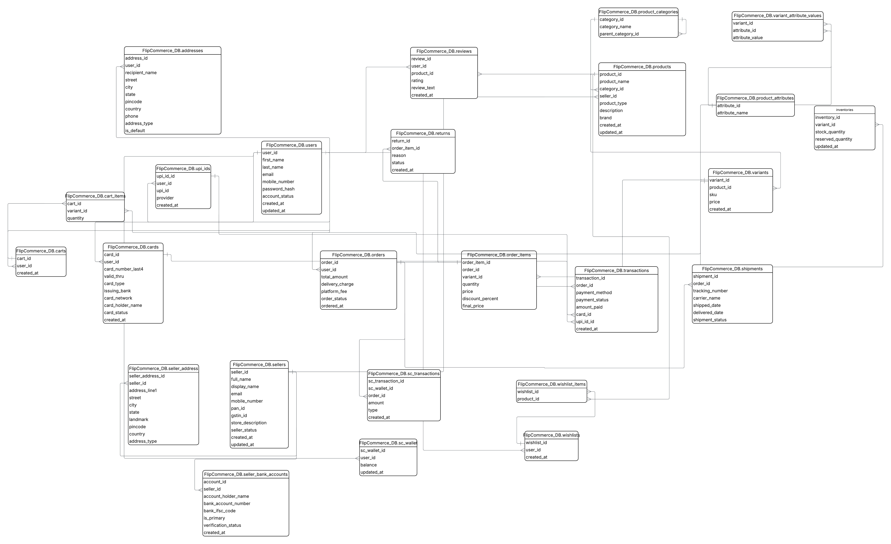
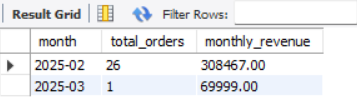
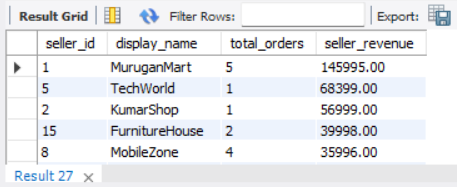
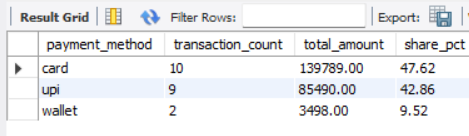

<div align="center">

# 🛒 FlipCommerce DB

### A Scalable Relational Database Schema for a Large-Scale Indian E-Commerce Marketplace

<div align="center">

[](https://www.mysql.com/)


</div>

*Inspired by marketplace architectures used in large-scale e-commerce platforms*

</div>

---

## 📌 Overview

**FlipCommerce DB** is a fully normalized relational database schema engineered for a large-scale Indian e-commerce marketplace. Built with MySQL 8.0+, it covers the complete lifecycle of an e-commerce platform — from user registration and product cataloging to order fulfillment, payment processing, logistics, and post-purchase analytics.

Beyond the schema, the project includes **25 analytical SQL queries** organized across **10 business domains**, simulating the exact reports that data, product, and operations teams run in real marketplace environments.

> **Goal:** Demonstrate end-to-end database engineering skills — schema design, normalization, referential integrity, and actionable SQL analytics — in a single, cohesive project.

---

## ✨ Key Highlights

| Area | Detail |
|---|---|
| 🗄️ **Database Engine** | MySQL 8.0+ with `utf8mb4` encoding |
| 📐 **Normalization** | Fully normalized to 3NF with proper use of surrogate keys |
| 🔗 **Referential Integrity** | All foreign key constraints explicitly defined |
| 📦 **Total Tables** | 22 tables across 11 functional domains |
| 📊 **Business Queries** | 25 queries across 10 analytical categories |
| 🇮🇳 **India-Specific Design** | UPI payments, SuperCoins loyalty wallet, GSTIN/PAN seller compliance, RuPay card network |
| 🔁 **Self-Referential Relationship** | Hierarchical product categories (subcategory support) |
| 💳 **Multi-Payment Support** | Card (Visa / Mastercard / RuPay / Amex), UPI (GPay / PhonePe / Paytm), Wallet |

---

## 🏗️ Database Architecture

The schema is organized into **11 functional domains**, each mapped to one or more tables:

```
FlipCommerce_DB
│
├── 👤  User Management        → users, addresses, cards, upi_ids
├── 🏪  Seller Management      → sellers, seller_address, seller_bank_accounts
├── 📦  Product Catalog        → products, product_categories, variants
│                                product_attributes, variant_attribute_values
├── 🏬  Inventory              → inventories
├── 🛒  Shopping               → carts, cart_items, wishlists, wishlist_items
├── 📋  Order Management       → orders, order_items
├── 💳  Payments               → transactions
├── 🚚  Logistics              → shipments
├── 🌟  Loyalty (SuperCoins)   → sc_wallet, sc_transactions
├── ⭐  Reviews & Ratings      → reviews
└── 🔄  Returns                → returns
```

---

## 🗂️ Entity Relationship Diagram

<div align="center">



*Full ER diagram generated from the FlipCommerce_DB schema*

</div>

---

## 📋 Table Reference

<details>
<summary><strong>👤 User Management (4 tables)</strong></summary>

| Table | Purpose |
|---|---|
| `users` | Core user accounts with status lifecycle (`active` / `inactive` / `suspended`) |
| `addresses` | Multi-address support per user with `home`, `work`, `other` types and a default flag |
| `cards` | Saved payment cards — stores last 4 digits only, supports Visa / Mastercard / RuPay / Amex |
| `upi_ids` | UPI VPAs linked per user; supports GPay, PhonePe, Paytm providers |

</details>

<details>
<summary><strong>🏪 Seller Management (3 tables)</strong></summary>

| Table | Purpose |
|---|---|
| `sellers` | Seller profiles with PAN, GSTIN for Indian tax compliance |
| `seller_address` | Multiple warehouse / office / pickup locations per seller |
| `seller_bank_accounts` | Bank accounts for seller payouts with verification workflow (`pending` → `verified` / `rejected`) |

</details>

<details>
<summary><strong>📦 Product Catalog (5 tables)</strong></summary>

| Table | Purpose |
|---|---|
| `product_categories` | Self-referential hierarchy — supports unlimited subcategory depth |
| `products` | Master product listings tied to seller and category; supports `physical` and `digital` types |
| `variants` | SKU-level product variants (e.g., color/size combinations) with individual pricing |
| `product_attributes` | Attribute dictionary (e.g., Color, Size, Material) |
| `variant_attribute_values` | Many-to-many bridge: assigns attribute values to each variant |

</details>

<details>
<summary><strong>🛒 Shopping Experience (4 tables)</strong></summary>

| Table | Purpose |
|---|---|
| `carts` | One active cart per user (enforced with `UNIQUE` constraint) |
| `cart_items` | Cart line items with variant-level granularity and quantity |
| `wishlists` | One wishlist per user |
| `wishlist_items` | Product-level wishlist entries (product, not variant — pre-purchase intent) |

</details>

<details>
<summary><strong>📋 Orders, Payments & Logistics (4 tables)</strong></summary>

| Table | Purpose |
|---|---|
| `orders` | Order header with total, delivery charge, platform fee, and status |
| `order_items` | Line items with price-at-time-of-purchase, discount %, and final price |
| `transactions` | Payment records linked to `card_id` or `upi_id_id` based on method |
| `shipments` | Carrier tracking with shipped/delivered timestamps for SLA measurement |

</details>

<details>
<summary><strong>🌟 Loyalty, Reviews & Returns (4 tables)</strong></summary>

| Table | Purpose |
|---|---|
| `sc_wallet` | SuperCoins balance per user (Flipkart-style loyalty currency) |
| `sc_transactions` | Credit/debit history per wallet, linked to orders |
| `reviews` | Product ratings (1–5 scale with CHECK constraint) and text reviews |
| `returns` | Return lifecycle per order item: `requested` → `approved` / `rejected` → `completed` |

</details>

---

## 📊 Business Intelligence Queries

The `Business_queries.sql` file contains **25 production-grade analytical queries** organized into **10 business domains** — directly mirroring the reports used by analytics, product, and operations teams at real e-commerce companies.

### Section Overview

| # | Domain | Queries | Business Purpose |
|---|---|---|---|
| 1 | 💰 Revenue & GMV Analysis | 5 | Platform KPIs — total GMV, monthly trends, category revenue, AOV |
| 2 | 🏪 Seller Performance | 3 | Top sellers, return rates, unverified bank accounts |
| 3 | 📦 Product & Inventory | 4 | Best sellers, low stock alerts, dead listings, wishlist gaps |
| 4 | 👥 Customer Analytics | 4 | VIP customers, abandoned carts, repeat rate, city-level demand |
| 5 | 💳 Payment Analytics | 2 | Payment method mix, failed/pending transaction recovery |
| 6 | 🚚 Logistics & Operations | 2 | Pending shipments dashboard, carrier SLA benchmarking |
| 7 | 🔄 Returns Analytics | 2 | Return rate by category, top return reasons |
| 8 | ⭐ Product Ratings | 1 | Average rating + review count for ranking signals |
| 9 | 🌟 Loyalty / Wallet | 1 | SuperCoin leaderboard for tiered benefits (Plus / Gold) |
| 10 | 🏷️ Discount Analysis | 1 | Discounted vs full-price revenue split and margin erosion |

---

### Query Highlights

<details>
<summary><strong>💰 Revenue & GMV Queries (5)</strong></summary>

```sql
-- Q1: Total Gross Merchandise Value (GMV)
-- Top-level KPI — how much did the platform sell in total?
SELECT ROUND(SUM(oi.final_price * oi.quantity), 2) AS total_gmv
FROM order_items oi
JOIN orders o ON o.order_id = oi.order_id
WHERE o.order_status != 'cancelled';

-- Q2: Monthly Revenue Trend
-- Identify growth, seasonal spikes, and slowdowns over time.
SELECT
    DATE_FORMAT(o.ordered_at, '%Y-%m') AS month,
    COUNT(DISTINCT o.order_id)         AS total_orders,
    ROUND(SUM(oi.final_price * oi.quantity), 2) AS monthly_revenue
FROM orders o
JOIN order_items oi ON oi.order_id = o.order_id
WHERE o.order_status != 'cancelled'
GROUP BY month
ORDER BY month;
```

*Also includes: Revenue by Category · Average Order Value (AOV) · Physical vs Digital Revenue Split*

</details>

<details>
<summary><strong>🏪 Seller Performance Queries (3)</strong></summary>

```sql
-- Q7: Seller Return Rate — Flag sellers with high return rates for quality review
SELECT
    s.display_name,
    COUNT(DISTINCT oi.order_item_id)  AS total_items_sold,
    COUNT(DISTINCT r.return_id)       AS total_returns,
    ROUND(
        COUNT(DISTINCT r.return_id) * 100.0 / COUNT(DISTINCT oi.order_item_id), 2
    ) AS return_rate_pct
FROM sellers s
JOIN products p  ON p.seller_id  = s.seller_id
...
ORDER BY return_rate_pct DESC;
```

*Also includes: Top Sellers by Revenue · Sellers with Unverified/Rejected Bank Accounts*

</details>

<details>
<summary><strong>👥 Customer Analytics Queries (4)</strong></summary>

```sql
-- Q14: Customers with Abandoned Carts — Trigger re-engagement campaigns
SELECT
    u.user_id,
    CONCAT(u.first_name, ' ', COALESCE(u.last_name,'')) AS customer_name,
    COUNT(ci.variant_id) AS cart_item_count
FROM users u
JOIN carts c       ON c.user_id  = u.user_id
JOIN cart_items ci ON ci.cart_id = c.cart_id
WHERE u.user_id NOT IN (SELECT DISTINCT user_id FROM orders)
GROUP BY u.user_id ORDER BY cart_item_count DESC;
```

*Also includes: Top 10 Customers by LTV · Repeat Purchase Rate · City-wise Order Volume*

</details>

<details>
<summary><strong>💳 Payment Analytics Queries (2)</strong></summary>

```sql
-- Q17: Payment Method Distribution — Includes window function for percentage share
SELECT
    payment_method,
    COUNT(*)                                        AS transaction_count,
    ROUND(SUM(amount_paid), 2)                      AS total_amount,
    ROUND(COUNT(*) * 100.0 / SUM(COUNT(*)) OVER (), 2) AS share_pct
FROM transactions
WHERE payment_status = 'success'
GROUP BY payment_method;
```

</details>

---
## 📈 Sample Query Outputs

### Monthly Revenue Trend

Tracks platform growth by month using order volume and GMV.



### Top Sellers by Revenue

Identifies the highest-performing sellers based on total orders and revenue generated.



### Payment Method Distribution
Analyzes customer payment preferences and percentage share across payment methods.



---
## 🚀 Getting Started

### Prerequisites

- MySQL 8.0 or higher
- MySQL Workbench (optional, recommended for visualizing the ER diagram)


### Installation

**1. Clone the repository**

```bash
git clone https://github.com/ppranesh2b/FlipCommerce-DB.git
cd FlipCommerce-DB
```

**2. Create the schema and tables**

```bash
mysql -u root -p < FlipCommerce_DB_table_schema.sql
```

Or run it directly in MySQL Workbench / any SQL client.

**3. Insert synthetic data**

```bash
mysql -u root -p FlipCommerce_DB < FlipCommerce_DB_table_data.sql
```

**4. Run the business queries**

```bash
mysql -u root -p FlipCommerce_DB < Business_queries.sql
```

---

## 📁 Project Structure

```text
FlipCommerce-DB/
│
├── FlipCommerce_DB_table_schema.sql      # Complete Schema
├── FlipCommerce_DB_table_data.sql        # Data generated to simulate realistic E-commerce workloads     
├── Business_queries.sql                  # 25 analytical/business queries
│
├── assets/
│   ├── Entity_relationship_diagram.png   # Full ER diagram
│   │
│   └── query_outputs/                      
│       ├── revenue_trend.png
│       ├── top_sellers.png
│       └── payment_mix.png
│
└── README.md                             # Project documentation                     
```
---

## 🧠 Design Decisions & Engineering Choices

| Decision | Rationale |
|---|---|
| **Surrogate `BIGINT` primary keys** | Scales to billions of rows; decoupled from business logic |
| **`DECIMAL(10,2)` for all monetary values** | Avoids floating-point rounding errors in financial calculations |
| **`price` snapshot in `order_items`** | Preserves price-at-time-of-purchase — product prices change over time |
| **`reserved_quantity` in inventories** | Prevents overselling during concurrent checkouts (cart → order gap) |
| **Self-referential `product_categories`** | Supports unlimited category depth (e.g., Electronics → Mobiles → Smartphones) |
| **Separate `variants` and `products`** | Clean separation of product identity from SKU-level attributes and pricing |
| **`card_number_last4` only** | PCI-DSS compliance — full card numbers are never stored |
| **`upi_id_id` naming in `transactions`** | Explicit FK disambiguation between `upi_ids.upi_id_id` and `upi_ids.upi_id` |
| **Status ENUMs everywhere** | Enforced data integrity at the DB layer — no invalid states possible |
| **`ON UPDATE CURRENT_TIMESTAMP`** | Automatic audit trail on mutable entities (users, sellers, products) |

---

## 🛠️ Tech Stack

<div align="left">


</div>

**SQL Features Used:**
- `JOIN` (INNER, LEFT) across complex multi-table chains
- Window functions (`SUM() OVER ()`, `COUNT() OVER ()`) for share percentages
- Correlated subqueries for exclusion logic (products never ordered, users without purchases)
- `DATE_FORMAT` for time-series trend analysis
- `COALESCE` for null-safe string handling
- Aggregate functions with `HAVING` for post-group filtering
- `DATEDIFF` for logistics SLA calculations
- `CASE WHEN` for conditional revenue bucketing

---

## 🔮 Potential Extensions

- [ ] Add `coupons` / `promo_codes` table with usage limits and expiry
- [ ] Add `notifications` table for order status push events
- [ ] Add `seller_ratings` separate from `product_reviews`
- [ ] Implement stored procedures for order placement and inventory reservation
- [ ] Add `audit_log` table for schema-level change tracking
- [ ] Migrate analytical queries to views for reusability

---

## 👨‍💻 Author
**PRANESH P**  
*Data Analytics Graduate • Building AI & Data Analytics Projects*

🔗 [LinkedIn](https://www.linkedin.com/in/ppranesh2b) •
📧 [Email](mailto:ppranesh2b@gmail.com)


 
